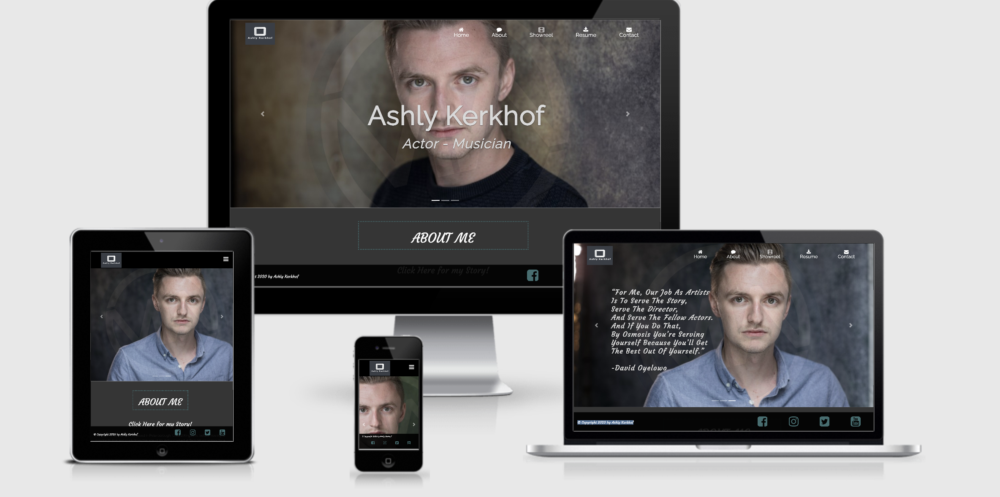

<!-- PROJECT LOGO -->
 

  

  <h3 align="center">Ashly Kerkhof Acting Page</h3>

  

    The idea is too make it so accessable that people will be able to see the work i have done,
    plus all of the information about me such as; my career and life, my cv, my showreel and all of my headshots in one place.

    inspiriation was taken from a lot of portfolios on the interent, i looked at many acting pages, and took inspiration from the things i liked,
    such as the hover gallery. I really wanted it to be slick and accessible to everyone.
    

     
    <a href="https://github.com/ashlykerkhof/ms1-project-1"><strong>Explore the docs »</strong></a>
     
     
    <a href="https://ashlykerkhof.github.io/MS1-project-1/">View Demo</a>
  

<!-- TABLE OF CONTENTS -->
## Table of Contents

* [About the Project](#about-the-project)
  * [Built With](#built-with)
* [UX](#UX)
  * [User Stories](#use-stories)
  * [Wireframes](#WireFrames)
  * [Mockup](#MockUp)
* [License](#license)
* [Media](#media)
* [Contact](#contact)
* [Acknowledgements](#acknowledgements)

<!-- ABOUT THE PROJECT -->
## About The Project

The acting page is used to market myself for casting directors and directors, making it easier to find my recent work and to find my current resume.

### Built With

* [Bootstrap](Bootstrap)
* [Hover.css](Hover.css)
* [Html/CSS](Html/Css)
* [JQuery](JQuery)
* [Javascript](Javascript)

<!-- User Experience-->

## UX

The project is designed for the use of actors to portray their work to casting directors and directors alike. The website will showcase all of the actors work and achievements, while also keeping the casting directors attention using specific interaction.
The idea of the site is to make it easier for people to find the actors work rather than having to go through links and doing their own research, as you can see from the site, everything is compact and easy to use. 
The layout is all on one page to make it easier to traverse and keep the user interested, a nav bar has been situated at the top as well to easily swap between tabs making it quick and easy to get to where they need to go.
In my mind this is the best way for an actor to martket themselves.

## User Stories

A couple of things i would want as a user;

1. I want to be able to traverse the page simply, so i can see all i need to see without wasting to much time.
2. i want to see everything on one page so i don't have to load up different tabs to favoiurite the work.
3. i want to be able to contact the actor using the contact button at the moment, i'd also like to be able to contact the agent if needed.
4. i want the gallery to be interactive and appealing to the eye, so i can scroll through pictures quick and easy.

## Wireframes

## Mockup

As you can see the website is responsive on all devices.

<!-- LICENSE -->
## License

Copyright and lincensing done by me. 

<!-- CONTACT -->
## Contact

Your Name - [@twitter_handle](https://twitter.com/Ashlykerkhof) - email: Ashly.Kerkhof@outlook.com

Project Link: [https://github.com/ashlykerkhof/ms1-project-1](https://github.com/ashlykerkhof/ms1-project-1)

<!-- ACKNOWLEDGEMENTS -->
## Acknowledgements

* [FloatPanel] (Float Panel)
* [W3school](W3school)
* [Slack](Slack)

